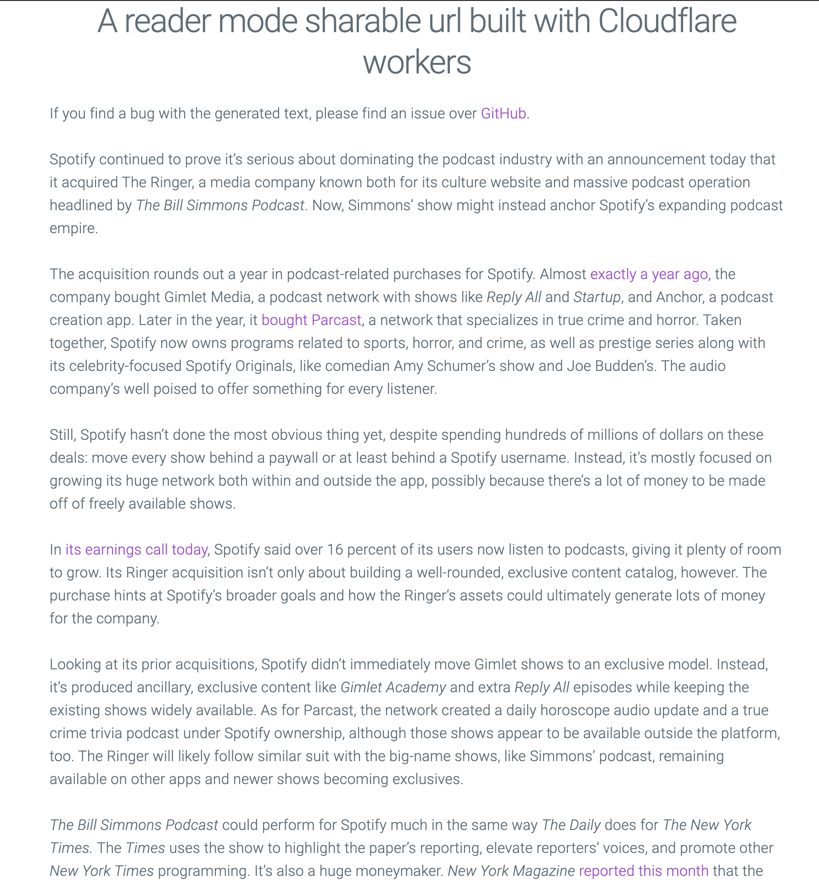

🤓 reader
======

An attempt to build a reader mode for any url with [Cloudflare workers](https://workers.cloudflare.com/).

While reader mode is built-in in pretty much all browsers, getting a reader mode sharable link is not possible. This project is an attempt to solve that problem.

The end goal is like to get a sharable url [like this](https://reader.tuananh.net/?url=https://www.theverge.com/2020/2/5/21124201/bill-simmons-the-ringer-spotify-acquistion-podcast-purchase)

```
https://reader.tuananh.net/?url=https://www.theverge.com/2020/2/5/21124201/bill-simmons-the-ringer-spotify-acquistion-podcast-purchase
```

Upon navigating to the above url, it will render the target domain in reader mode.



## Features

* Get a pretty, sharable reader mode url.
* Bypass subscription.
* Cached by Cloudflare.

## TODO

* Dark mode.
* [x] Use a more lightweight css framework instead of milligram.

## Usage

You can setup a bookmarklet to use this.

```
javascript:(function()%7Bwindow.open('https%3A%2F%2Freader.tuananh.net%2F%3Furl%3D'%2Bwindow.location.href%2C%20'_blank')%7D)()
```

## License

Copyright 2020 Tuan Anh Tran <me@tuananh.org>

Permission is hereby granted, free of charge, to any person obtaining a copy of this software and associated documentation files (the "Software"), to deal in the Software without restriction, including without limitation the rights to use, copy, modify, merge, publish, distribute, sublicense, and/or sell copies of the Software, and to permit persons to whom the Software is furnished to do so, subject to the following conditions:

The above copyright notice and this permission notice shall be included in all copies or substantial portions of the Software.

THE SOFTWARE IS PROVIDED "AS IS", WITHOUT WARRANTY OF ANY KIND, EXPRESS OR IMPLIED, INCLUDING BUT NOT LIMITED TO THE WARRANTIES OF MERCHANTABILITY, FITNESS FOR A PARTICULAR PURPOSE AND NONINFRINGEMENT. IN NO EVENT SHALL THE AUTHORS OR COPYRIGHT HOLDERS BE LIABLE FOR ANY CLAIM, DAMAGES OR OTHER LIABILITY, WHETHER IN AN ACTION OF CONTRACT, TORT OR OTHERWISE, ARISING FROM, OUT OF OR IN CONNECTION WITH THE SOFTWARE OR THE USE OR OTHER DEALINGS IN THE SOFTWARE.